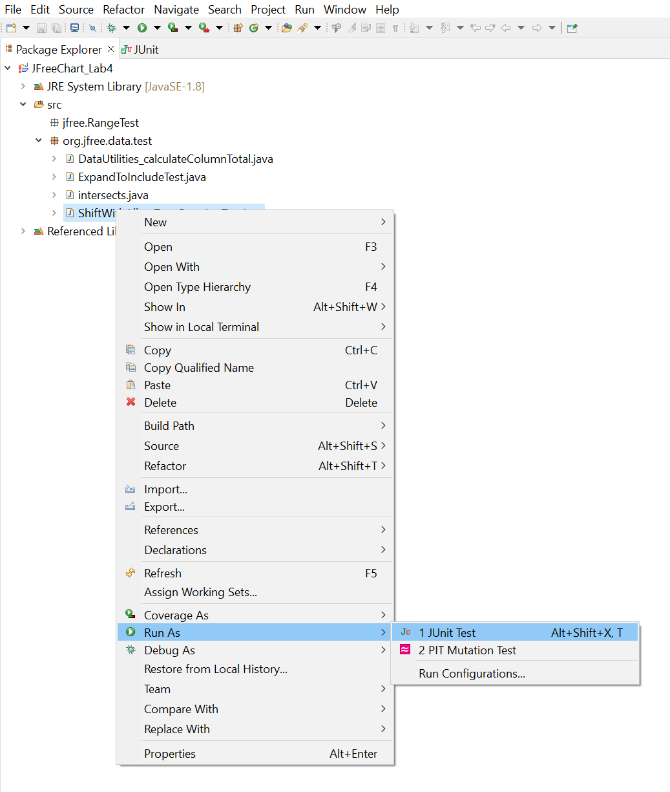
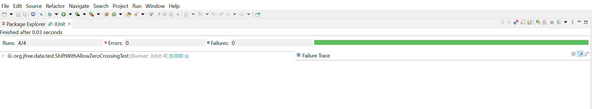
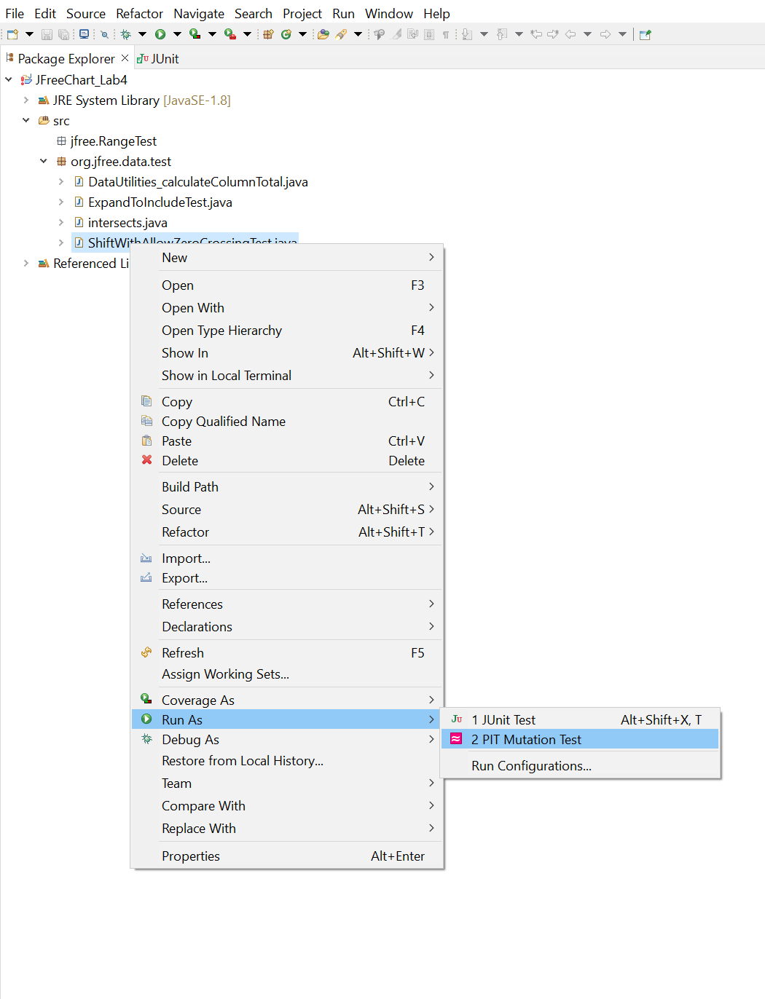
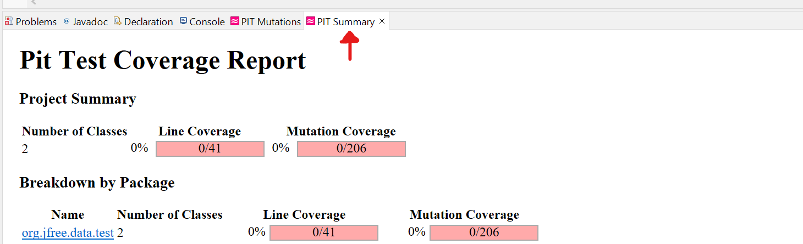
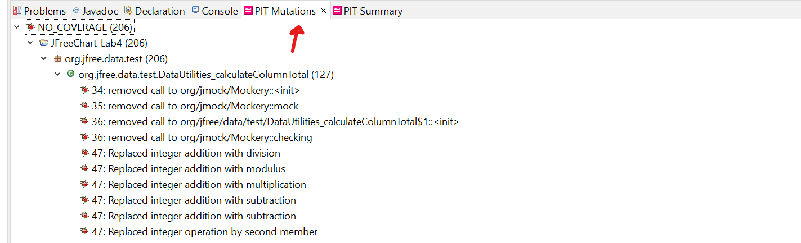
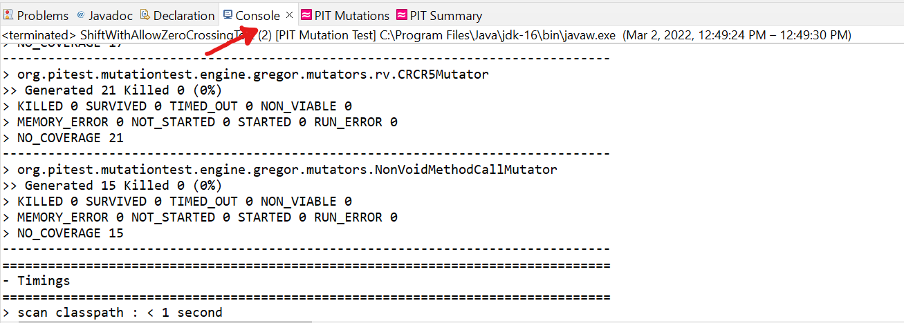

**SENG 637 - Dependability and Reliability of Software Systems**

**Lab. Report \#4 – Mutation Testing and Web app testing**

| Group \#:6     |     |
| -------------- | --- |
| Student Names: |     |
| Sean Temple    |     |
| John Chernoff               |     |
| Nicholas Langley               |     |
| Raisa Mehjabin Azni            |   
| Eric Yoon            |   

## 2.5 INSTRUCTIONS

## 2.5.1 Mutation Testing

You should run Pitest on your own test suites `DataUtilitiesTest`** and `RangeTest`** from assignment 3.

### 2.5.2 Create a new Eclipse project

Add the JFreeChart source code given in assignment 4 to your project. Add all libraries into your project. Add the given sample test codes (provided in this assignment) into your project.

## 2.5.3 Add your own Test Suites from lab 3 into your new project.

### 2.5.4 Run Mutation Testing on the sample test cases

As a practice, run mutation tests on the test cases provided under `org.jfree.data.junit` in the test folder of _JFreeChart_Lab4_ project. Record all results. (Right click on the `org.jfree.data.junit` and then run as PIT Mutation Test)

1.  Note that in order to run mutation tools successfully, your test cases must pass (all green). For example, the `DataUtilitiesTes` test case has error in `org.jfree.data.junit`, running Pitest you will get exception. If there is any defect that is found by the tests (error/failure), they need to be fixed in the code before running the mutation tool.

2.  Expect that mutation testing of some classes might take long time. Let the tool runs and do not terminate it until the test ends and you get the mutation testing reports.

> 

> 

> 

### 2.5.5 Run Mutation Testing on your own test cases

- Run mutation tests on your `Range` test classes from assignment 3. Record all results.

- Run mutation tests on your `DataUtilities` test classes from lab 3. Record all results.

  - You might require to fix your test codes, if you find out that your test cases are not correct.

  - You might require to fix the source code, if your test code detects any defect.

- Analysis of at least 10 mutants produced by Pitest for the `Range` class, and how they are killed or not by your original test suite

### 2.5.6 Equivalent Mutants

Try to come up with a way that you could automatically detect a few equivalent mutants in your experimentation, for classes `Range` and `DataUtilities`. If you think you have found a way, discuss it in your report, along with its benefits, disadvantages, and assumptions. Try to detect a few equivalent mutants manually in classes `Range` and `DataUtilities` (to do this, you will need to investigate the mutation logs generated by the tool).
Report the process you followed for this part plus your findings and results in your lab report. Note that the number of equivalent mutants found is not as important as the understanding of how to detect them and the discussion of how you found them.

### 2.5.7 Add More Test Cases to increase Mutation Score

In this phase, we want to increase the mutation score. For each of the classes under mutation testing (`Range` and `DataUtilities`), measure the mutation score of your original test suites from assignment 3. Aim at increasing mutation scores for `Range` and `DataUtilities` each by at least 10% , e.g., if it is 55%, make it at least 65%. Discuss in your report the test cases that you had to add to increase the mutation score, and also how you designed them.

# Introduction

# Analysis of 10 Mutants of the Range class 

# Report all the statistics and the mutation score for each test class
NOTE: These values include the methods that are not covered by any test cases

Range:

DataUtilities:

# Analysis drawn on the effectiveness of each of the test classes

# A discussion on the effect of equivalent mutants on mutation score accuracy

# A discussion of what could have been done to improve the mutation score of the test suites

# Why do we need mutation testing? Advantages and disadvantages of mutation testing

# Explain your SELENUIM test case design process

# Explain the use of assertions and checkpoints

# how did you test each functionaity with different test data

# How the team work/effort was divided and managed

# Difficulties encountered, challenges overcome, and lessons learned

# Comments/feedback on the assignment itself

# 4 Evaluation Criteria

## 4.1 Lab report and Test suites (100%)

Students will be required to submit a report on their work in the lab as a group. To be consistent, please use the template markdown file “Assignment4-ReportTemplate.md” provided online under the Assignment 4 folder. If desired, feel free to rename the sections, as long as the headings are still descriptive and accurate.

**NOTE2: include folder together with your report. One containing Part 1’s final test suite, another containing Selenium test scripts.**

A portion of the grade for the lab report will be allocated to organization and clarity. The report marking scheme is as follows:

| **Mutation Testing (50)**                                                                                                                                         |     |
| ----------------------------------------------------------------------------------------------------------------------------------------------------------------- | --- |
| Analysis of at least 10 mutants produced by Pitest for the `Range` class, and how they are killed or not by your original test suite                              | 10  |
| All the statistics and the mutation score for each of the mutated classes (`Range` and `DataUtilities`) with each test suite class (original and the updated one) | 20  |
| A discussion on the effect of equivalent mutants on mutation score accuracy including a discussion on how equivalent mutants could be detected                    | 10  |
| A discussion of how you improved the mutation score of the test suites. Your design strategy.                                                                     | 5   |
| A discussion on the advantages and disadvantages of mutation testing                                                                                              | 5   |
| **GUI Testing (40)**                                                                                                                                              |     |
| Correctness and completeness of the Recorded test cases (at least 2 per group member)                                                                             | 10  |
| Explain your test case design process                                                                                                                             | 10  |
| Use of automated verification points in each script. If automated verification point is not used, provide valid reason                                            | 10  |
| Use different test data per test. If not used, provide valid reason                                                                                               | 10  |
| **Other (10)**                                                                                                                                                     |     |
| A discussion on how the team work/effort was divided and managed. Any lessons learned from your teamwork on this lab?                                             | 5   |
|Comments/feedback on the assignment itself  | 5   |

# 5 REFERENCES

[1] J. O. Yu-Seung Ma, "Description of Class Mutation Operators for Java,"2005\.(http://cs.gmu.edu/\~offutt/mujava/mutopsClass.pdf)

[2] J. O. Yu-Seung Ma, "Description of Method-level Mutation Operators for Java," 2005. (http://cs.gmu.edu/\~offutt/mujava/mutopsMethod.pdf)

[3] "JFreeChart," Internet: <http://www.jfree.org/jfreechart> [4] "Pitest," Internet: <http://pitest.org/>
