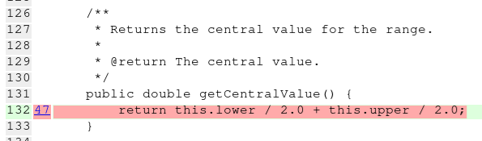
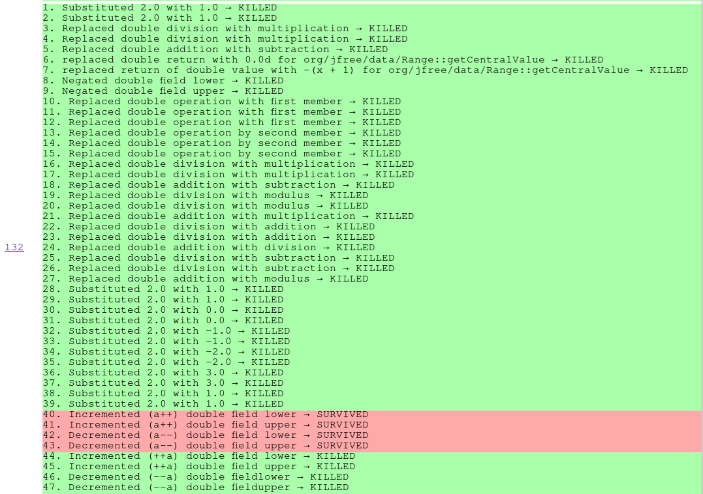
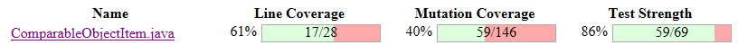
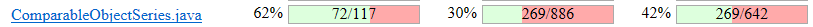
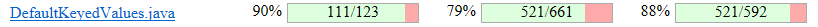
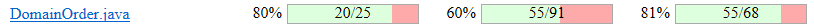
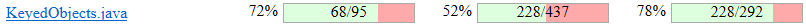
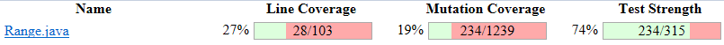
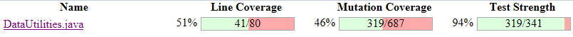
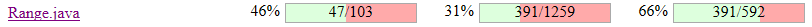

**SENG 637 - Dependability and Reliability of Software Systems**

**Lab. Report \#4 – Mutation Testing and Web app testing**

| Group \#:6     |     |
| -------------- | --- |
| Student Names: |     |
| Sean Temple    |     |
| John Chernoff               |     |
| Nicholas Langley               |     |
| Raisa Mehjabin Azni            |   
| Eric Yoon            |   


# Introduction
This assignment is about using and understanding mutation testing. First step was running the provided tests and the tests from previous assignments for mutation coverage and then understanding how the mutations work. After understanding the details of how the mutations work we endeavoured to improve our mutation testing coverage.

# Analysis of 10 Mutants of the Range class 

**Constrain mutants:**
 
 *1. constrain : Incremented (a++) double local variable number 1 -> Survived*
 
 This mutant survives, primarily because there are no tests for constrain where value is very close to the edge of the range
 
 **Relevant code** 
 ```
 double result = value;  // value is incremented AFTER being assigned to result (value++)  
    if (!contains(value)) {    // if value was increased from within range to out of range, these conditional statements would behave differently and the mutant would be killed.    
		if (value > this.upper)     
```   
Since no tests exhibit this change in behaviour due to the increment, the mutant survives. The current tests at upper bound do not catch this since the out of range value is just constrained back to the expected upper bound value.  
This is a good example for the importance of testing values very near to the boundary values   

A similar mutant exists for the post decrement (a--) behaviours near the lower bound  

<br /><br />

*2. constrain : removed conditional - replaced equality check with true -> SURVIVED*  
 
**Relevant code**    
```
if (!contains(value)) {  //this is the if statement being replaced with TRUE --- if (TRUE)    
            if (value > this.upper) {  //only runs if the above conditional is true    
                result = this.upper;    
            }    
            else if (value < this.lower) { //else if... also can only run if the parent conditional is true    
                result = this.lower;    
            }    
        }
```	
This mutant survives, because the enclosed if statements also implicitly check that the value is within the range. If the value is out of range but gets to these checks anyway (due to the mutant), nothing happens.
As a result this mutant cannot be killed without changing the actual code to be less robust(for example changing the child if statements to end with 'else').

The opposite mutant (replacing conditional with FALSE) is correctly killed as it prevents the interior code from ever running

<br /><br />

*3. constrain : Negated double field upper -> SURVIVED*    
    
**Relevant code**   
```
            if (value > this.upper) {  //Negated value here --- if (value > -1*this.upper)    
                result = this.upper;    
            }    
```   
This mutant survives because there is only 1 test that could be affected by this mutant but the effect is barely missed    
the test is as follows range(-10, 20) and constrained value is -22.    
Since the input value is still lower than the negated upper value (-20), the test was unaffected and the mutant survived    
    
Adding tests with similar equivalence classes but differing values would kill more mutants like this. Increasing the diversity of the tests at the cost taking more time to implement and run them    

**getLength Mutants:**
   
*4. getLength: Replaced double subtraction with addition → KILLED*

This mutant is killed because the test cases for getLength expect specific values based on the subtracted values. By replacing subtraction with addition the results produced are significantly incorrect and easily detected by the test cases.

**Relevant code**   
```
    public double getLength() {
        return this.upper - this.lower; //Replacing '-' with '+' here produces significantly incorrect results which are detected by test cases.
    }
```  

*5. getLength: Replaced double subtraction with multiplication → KILLED*

This mutant is killed because the test cases for getLength expect specific values based on the subtracted values. Similarly to the previous mutant, by replacing subtraction with multiplication the results produced are quite different than the correct values, and easily detected by the test cases. 

**Relevant code**   
```
    public double getLength() {
        return this.upper - this.lower; //Replacing '-' with '*' here produces significantly incorrect results which are detected by test cases.
    }
```  

*6. getLength: Incremented (a++) double field lower → SURVIVED*

This mutant survived, likely because the test cases are rounding or don't assert values with high precision. There also aren't any direct tests that assert the change in length due to a single increment of the lower bound, adding such a test case would kill this mutant.

**Relevant code**   
```
    public double getLength() {
        return this.upper - this.lower; //Incrementing the lower bound here (lower++) can affect the result, depending on the sensitivity of tests to the incremented amount.
    }
```  

**getCentralValue mutants:**
> Method's code

> getCentralValue() is a single statement method.

> 47 different mutations applied to this single line.
> - Mutation type 1 substituted the values 2.0 with 1.0 (Mutation 1, 2, 28, 29, 38, 39): Replaces the constant 2.0 with 1.0 in the expression this.lower / 2.0 + this.upper / 2.0. This type of mutation was always detected by the test suite meaning it triggered a test failure and was "KILLED". It makes sense that it would be detected as it changes the expression in a way that cause a incorrect value to be returned.
> - Mutation type 2 replaced math operators with different operations. (Mutations 3, 4, 5, 16, 17, 18): For the same reasons as the first type the return value will be incorrect and the test will fail. 
> - Mutation type 3 replaces the math expression with 0.0d (Mutation 6): Any test expecting a value of 0.0 may pass but the rest fail causing the Mutation to be killed.
> - Mutation type 4 replaces the math expression x with -(x-1). (Mutation 7) example: 
> 
>  return this.lower / 2.0 + this.upper / 2.0;
> 
> becomes:
> 
>   return -(this.lower / 2.0 + this.upper / 2.0 + 1);
> 
> The wrong value will be returned and caught by the Junit test killing the Mutation.
> - Most of the rest of the tests follow a similar pattern causing return value to be incorrect; except for the postfix operation mutations(Mutations 40, 41, 42, 43):
> 
> This is because the postfix operator doesn't change the upper and lower values until after the upper and lower values are used in the math expression. The return value is unaffected so all tests pass. 
> 
> The value of lower and upper are incremented in the function when they shouldn't be. In C++ the method could be made const preventing writing to member variables, we will have to write tests to check for member variable manipulation in methods that should be read only.


# Report all the statistics and the mutation score for each test class
NOTE: These values include the methods that are not covered by any test cases

RangeSample:


DataUtilitiesSample:


ComparableObjectItem:


ComparableObjectSeries:


DefaultKeyedValues2D:


DefaultKeyedValues:


DefaultKeyedValue:


DomainOrder:


KeyedObjects2D:


KeyedObjects:


KeyedObject:


KeyToGroupMap:


RangeType:


Range:


DataUtilities:


# Analysis drawn on the effectiveness of each of the test classes

Overall, it looks like some classes such as DefaultKeyedValues and RangeType have strong tests, while others like ComparableObjectItem and ComparableObjectSeries have relatively weak tests. The goal should be to have both high line coverage and high mutation coverage for the most effective test suite. Lower mutation coverage suggests that the tests may not be challenging the code thoroughly, possibly missing out on edge cases and potential bugs.

RangeSample (Range.java): It has good line coverage (84%) and mutation coverage (73%), with high test strength (86%). This suggests that the tests for RangeSample are quite effective.

DataUtilitiesSample (DataUtilities.java): The line coverage is at 80% with slightly lower mutation coverage (68%) but a high test strength (86%). The test suite seems effective but could perhaps be improved slightly in terms of mutation coverage.

ComparableObjectItem (ComparableObjectItem.java): This has lower line coverage (61%) and mutation coverage (40%), indicating that there's a significant amount of code that is not being tested effectively.

ComparableObjectSeries (ComparableObjectSeries.java): Similar to ComparableObjectItem, this has low line coverage (62%) and low mutation coverage (30%), suggesting that this test class is not very effective and there are likely many untested paths.

DefaultKeyedValues2D (DefaultKeyedValues2D.java): Line coverage is fairly high at 79%, and mutation coverage is reasonable at 59%, but this suggests there is room for improvement.

DefaultKeyedValues (DefaultKeyedValues.java): This has excellent line coverage (90%) and high mutation coverage (79%), with a high test strength of 88%. This is indicative of a strong test suite.

DefaultKeyedValue (DefaultKeyedValue.java): With line coverage at 76% and mutation coverage at 39%, it shows a significant number of mutants are not detected, suggesting potential weaknesses in the test suite.

DomainOrder (DomainOrder.java): With high line coverage (80%) and decent mutation coverage (60%), this test class seems fairly effective.

KeyedObjects2D (KeyedObjects2D.java): The line coverage is excellent (84%), but mutation coverage is lower (55%), which might indicate that while many lines are tested, the tests might not be effectively catching all potential issues.

KeyedObjects (KeyedObjects.java): With 72% line coverage and 52% mutation coverage, this test class could be improved to be more effective.

KeyedObject (KeyedObject.java): The line coverage is only at 78%, and the mutation coverage is low (70%), which might suggest that certain edge cases are not being tested.

KeyToGroupMap (KeyToGroupMap.java): Both line coverage and mutation coverage are at 80% and 66% respectively, indicating a fairly effective test suite.

RangeType (RangeType.java): This has high line coverage and mutation coverage (both 80%), which is indicative of a strong test suite.

# A discussion on the effect of equivalent mutants on mutation score accuracy

Mutants are considered equivalent if they don't introduce detectable faults that can be caught by a test suite. To detect mutants entirely automatically would be quite difficult since there is no functionality within PIT or Stryker to do this. However, a combination of manual inspection and automated detection can be used to find equivalent mutants through the following steps:

1. Run the mutation and filter out all killed mutants, since killed mutants cannot be equivalent.
2. Look at each survived mutant and examine it thoroughly, find if the mutant could ever lead to a different output or side effect under any input conditions. If the mutant never leads to a different output, its equivalent.
3. Check if the mutated operation is critical for the method's outcome, or if it has no effect on observable behavior but is involved in background computations. If it does have an effect on observable behavior but produces the same outcome as the non mutated operation, it is equivalent.

A benefit of this strategy is that test coverage and quality will be improved as equivalent mutants are killed. Furthermore, this process will help the tester gain a deeper understanding of the codebase. Disadvantages of this approach include its high complexity and time consumption to complete. The strategy assumes that the test suite is complete and can detect non-equivalent mutants, while it also assumes the tester has a good understanding of the program's behavior.

**Equivalent Mutants in Range**

Mutation 91-5 (Survived): Negated double local variable number 1.

Mutation 91-6 (Survived): Incremented (a++) double local variable number 1.

Mutation 91-7 (Survived): Decremented (a--) double local variable number 1.

These mutations involve arithmetic operations on double variables and all survived, indicating that the test suite might not be effectively checking the results of such operations due to a lack of assert statements specifically targeting the effects of these arithmetic manipulations or the presence of values that do not significantly affect the outcome in a way that the tests can detect.

**Equivalent Mutants in DataUtilities**

Mutation 155-3 (Survived): removed conditional - replaced comparison check with true.

Mutation 155-4 (Survived): greater or equal to equal.

Mutation 155-9 (Survived): greater or equal to greater than.

These mutations are equivalent because they all involve alterations to conditional logic that affect how decisions are made in the code, and they all survived. They demonstrate that the tests do not adequately cover scenarios where these conditional checks are manipulated, potentially indicating areas where the test coverage could be improved.

# A discussion of what could have been done to improve the mutation score of the test suites

To improve the mutation test score of the test suites, we focused on enhancing the test coverage to include scenarios that may not have been thoroughly tested, especially those that could reveal untested behavior in edge cases or error conditions. By carefully examining the classes and their methods, we identified areas where additional tests could be beneficial.

**Range**

For the expand method, the tests now include scenarios where the range is expanded with zero margins to check if it remains the same, with negative margins to explore unusual behaviors, and cases where expanding causes the lower bound to surpass the upper bound or vice versa, to understand its handling of such conditions. The shift method's tests are expanded to cover shifts by zero, ensuring no change; negative shifts, to confirm the range moves as expected; and the effect of the allowZeroCrossing parameter when the shift crosses zero, to ensure it behaves correctly under both settings.

Coverage is also improved for assessing the hashCode and equals methods by comparing ranges with minor differences to see if equals discerns them as different and checking that hashCode is consistent across different and identical ranges. For the scale method, tests are added to observe behavior when scaling by factors of 1, greater than 1, less than 1, and 0, to assess appropriate scaling actions.

Additional testing includes ensuring the serialization and deserialization of a Range object maintains its integrity, indicating a focus not just on method functionalities but also on object state preservation across processes. Finally, thorough testing of constructors now ensures ranges are correctly initialized whether they have equal lower and upper bounds or involve values like Double.POSITIVE_INFINITY and Double.NEGATIVE_INFINITY, providing a comprehensive check on range instantiation under diverse conditions.

**Data Utilities** 

For the equal method, tests are designed to cover various edge cases, including comparing arrays of differing lengths, arrays of the same length but with different values, and comparing a null array with a non-null array to verify correct equality assessments. In testing the clone method, the suite includes tests for cloning an array that includes null values, as well as cloning an empty array, to ensure that the cloning process accurately replicates the original array's structure and content, including handling of nulls and maintenance of the original array's size and shape.

The tests for the calculateColumnTotal and calculateRowTotal methods are enhanced to cover situations with invalid column or row indices, and scenarios where the Values2D implementation may return null for some getValue calls, simulating missing data conditions. Additionally, the suite tests overloaded versions of these methods that operate on a subset of rows or columns specified by an array of indices, including edge cases where the indices array might be empty or contain invalid indices.

For the createNumberArray and createNumberArray2D methods, tests are added to check the handling of boundary values such as Double.MAX_VALUE and Double.MIN_VALUE, as well as arrays consisting entirely of NaN or Infinity values, ensuring the methods function correctly across the entire range of double values and handle special floating-point values as expected. Lastly, testing the getCumulativePercentages method involves scenarios where a KeyedValues instance returns NaN or Infinity for some values, where the total sum of all values is zero, and where the instance contains negative values. These tests are critical for understanding how the method calculates percentages in various unusual data scenarios, including the potentially undefined behavior with negative values.

Range:
> Results before and after these additions.



DataUtilities:
> Data Utilities before and after these additions.


# Why do we need mutation testing? Advantages and disadvantages of mutation testing

Software mutation testing is a technique used to evaluate the effectiveness of a software testing suite by intentionally introducing small changes, or "mutations," into the codebase and then checking if the test suite identifies and fails due to these changes. This approach offers several advantages. Firstly, it provides a concrete measure of the quality of the test suite, identifying specific areas where test coverage is lacking. This detailed feedback can guide developers to improve the test suite by adding tests where necessary, leading to more robust software. Secondly, mutation testing can help in understanding how changes to the code might impact the software's functionality, encouraging more thoughtful and resilient coding practices.

However, there are notable disadvantages to mutation testing. Some of the mutations don't provide any insight that would help in improving the source code. It is computationally expensive and time-consuming, as it requires running the entire test suite for each generated mutant, which can significantly slow down the development process, especially for large codebases. This may not be practical in a continuous integration environment where rapid feedback is essential. Additionally, mutation testing can generate a large number of mutants, some of which may be equivalent to the original code in their behavior, leading to false positives that waste developers' time and resources. Balancing the insights gained from mutation testing against its resource-intensive nature is a key challenge for teams considering its adoption.

# Explain your SELENUIM test case design process

We decided to proceed with Shop Smart Canada as our GUI website to test using Selenium. After discussion, we decided that the functionalities that are to be used most often by the user were the ones to focus on. With this in mind, the test case functionalities that we decided to pursue was as follows, after exploration of the website and its GUI: 

1. User Registration
2. Login 
3. Search Bar
4. Add/Remove Items from Homepage Cart
5. Logout 
6. Forgot Password
7. Change # of Products Displayed on the page
8. Different Item Selection on Home Page
9. Modify Account Settings
10. Create/Delete Wish List

Once these test case functionalities were decided on, a wireframe testing strategy of all functionalities, its different test data and its associated assertions/checkpoints were developed, and is found in the “Test Cases” file in the git repo. To explain, one of the functionality is shown below: 

Test Case 10. Create/Delete wishlist
1. Sign in and go to account settings - wish list.
2. Create 3 wishlists and verify each step of creation.
3. Delete 1 wishlist and verify deletion of the single wishlist.
4. Delete all wishlists and verify deletion of all (two) wishlists.

There is a step-to-step process to follow through the Selenium IDE, and the different test data such as creating 3 wishlists, deleting different methods and the verification of each process is documented. As a result, each functionality is being validated for completion with different parameters, so GUI testing covers more features and different parameters. 

When running the tests, please ensure that each test from 1 to 10 is tested individually. 

# Explain the use of assertions and checkpoints

Assertions (verify text, verify element present, verify element not present) and its associated checkpoints are mainly used to verify at specific points that the functionalities (login, sign-on) are working as intended. There were different verification methods and checkpoints utilized for this assignment - for clarity, each logical assertion that is unique will be discussed. 

**User Registration - Verify Text:**

When the user successfully registers, the page goes to a separate page where a text box shows “Your account has been created”. This is the condition that we check to make sure user registration is valid. If the email is in use however, a text box prompting “The email address ericyoon4242@gmail.com is already in use. Please enter a different one.” is checked to see if it exists, verifying successful user registration.

**Login - Verify element not present:**

When the user successfully logins, the “verify element not present” is utilized as once you are signed in, the “login” button on the dashboard disappears. 

**Search Bar - Verify element present:**

When you search an item successfully, such as “Dyson”, multiple options pop up in the product page. We then search for if any product box elements exist in the product page, which means that there are items relevant to the search criteria. We can also reverse this for an invalid item, where something like “sadasdgsdg” can be verified with verify element not present for the same product box element. 

These assertions were used with creative logic, checking for certain items that are created when a button is pressed, or not created as well. Please take a look at the script for our assertion methods in detail. 

With respect to checkpoints, there were multiple verification stop points where it checks for numerous conditions. For example, looking at the functionality Add/Remove items from Homepage Cart there are numerous verification steps that check if the cart inventory increases when add to cart buttons are pressed. We also test out the addition of a different unique product with “verify element present” checking if there are more than 1 instance of previewcartitem, confirming there are two unique items in the bag. We then test the removal of one item, removal of all items and have verification points for each task. This logic and checkpoint usage makes our tests work step-by-step for easier validation and analysis for the user.

# how did you test each functionaity with different test data

1. **User Registration:**
Invalid Email Format: Entered an email address with an incorrect format (e.g., missing "@" symbol).
Invalid Password Entry: Entered an incorrect password format (e.g., too short, missing special characters).
Correct Registration: Successfully registered with an email that is in use, and another registration with a new email not in use.
2. **Login:**
Various scenarios included:
Empty user and password fields.
Empty email or password fields.
Incorrect email or password.
Correct email and password.
3. **Search Bar:**
Generic Search: Searched for a general term like "Dyson."
Specific Search: Searched for a specific product, such as "NutriBites Freeze-dried Beef Liver Dog and Cat Treats, 2 x 500g."
Invalid Search: Attempted to search using gibberish characters.
4. **Add/Remove Items from Homepage Cart:**
Addition of Different Items: Added various items to the cart, including one, same, and different items.
Removal of Items: Removed items from the cart individually and all items at once.
5. **Logout:**
Logged out from both the home page and the account page to ensure functionality across different sections.
6. **Forgot Password:**
Tested with both invalid and valid email formats.
7. **Change # of Products Displayed on the Page:**
Set different numbers of products to display per page to assess the display functionality.
8. **Different Item Selection on Homepage:**
Selected various categories like showers, tents, and iPads to verify navigation and product display.
9. **Modify Account Settings:**
Changed company name and attempted to change name and email both invalidly and validly.
Changed password and email.
10. **Create/Delete Wish List:**
Created multiple wishlists and deleted them individually and all at once.

Testing with different test data allows for thorough validation of the application's functionality under various conditions. It helps ensure that the system behaves correctly and remains robust even in scenarios that might not be anticipated initially. By covering a wide range of possible inputs and situations, we can enhance the reliability and quality of the application, ultimately providing a better user experience.

# How the team work/effort was divided and managed

The team was primarily divied into two groups, one for mutation testing and one for GUI testing. The groups dived their appropriate sections between them evenly. After the work was complete the groups swapped and checked eachothers work to learn from and improve it.

# Difficulties encountered, challenges overcome, and lessons learned

The Mutation testing revealed some flaws with our test set from the previous assignments, we were missing some tests close to the boundary values of certain methods, this meant that mutants which subtly changed these boundary values were not captured. It was a good lesson in ensuring that test suites are designed to more closely constrain themselves to the boundary values the avoid small errors like this.

Many of the mutation testing tools were difficult or impossible to get running. The provided links seemed to be not supported well, or the tool would have required comprehensive changes to the test suite to properly detect coverage. The tools were ultimately not used and just analyzed based on their documentation.

For Selenium, the main difficulty was creating up with test case functionalities and its respective verification method. For example, the test case of purchasing is a little hard to verify as we would have to buy products from the website. Other test cases such as login, we had to be creative in the verification such as checking if an element did not exist. As a result, really planning out the entire functionalities (10 to be exact) and its respective verification and different testing data was quite overwhelming at the start. 

Lessons learned was to manage the time better for this assignment. We ran into an interpretation issue of the assignment where initially we made 10 functionalities that were similar and testing out different parts of the same functionality (i.e. login invalidly is one function, login validly is another function) but realized that this was just a single functionality. So, we were rushed to create more functionalities to test, causing us to be stressed for time. 

# Comments/feedback on the assignment itself

The mutation testing portion of the assignment was interesting and very effective at teaching us the basics of mutation testing. We enjoyed the interactive process of making changes to the test code and seeing how it affected mutations generated and the mutation test scores. The instructions were not entirely clear on the setup process required to get the test suite working for mutation testing, one thing that would have helped would be including the JARs from assignment 2 for mocking with the rest of the assignment 4 JARs. 

For Selenium, the feedback we would give is to be a little more clear on what "different test data" means and provide just a few more examples. On the other hand, Selenium and its test development was very fun and easy to develop as the GUI tracks your actions and inputs. 

# 4 Evaluation Criteria

## 4.1 Lab report and Test suites (100%)

Students will be required to submit a report on their work in the lab as a group. To be consistent, please use the template markdown file “Assignment4-ReportTemplate.md” provided online under the Assignment 4 folder. If desired, feel free to rename the sections, as long as the headings are still descriptive and accurate.

<span style="color:MidnightBlue   ">**NOTE2: include folder together with your report. One containing Part 1’s final test suite, another containing Selenium test scripts.**

A portion of the grade for the lab report will be allocated to organization and clarity. The report marking scheme is as follows:

| **Mutation Testing (50)**                                                                                                                                         |     |
| --------------->>>>>>> Stashed changes-------------------------------------------------------------------------------------------------------------------------------------------------- | --- |
| Analysis of at least 10 mutants produced by Pitest for the `Range` class, and how they are killed or not by your original test suite                              | 10  |
| All the statistics and the mutation score for each of the mutated classes (`Range` and `DataUtilities`) with each test suite class (original and the updated one) | 20  |
| A discussion on the effect of equivalent mutants on mutation score accuracy including a discussion on how equivalent mutants could be detected                    | 10  |
| A discussion of how you improved the mutation score of the test suites. Your design strategy.                                                                     | 5   |
| A discussion on the advantages and disadvantages of mutation testing                                                                                              | 5   |
| **GUI Testing (40)**                                                                                                                                              |     |
| Correctness and completeness of the Recorded test cases (at least 2 per group member)                                                                             | 10  |
| Explain your test case design process                                                                                                                             | 10  |
| Use of automated verification points in each script. If automated verification point is not used, provide valid reason                                            | 10  |
| Use different test data per test. If not used, provide valid reason                                                                                               | 10  |
| **Other (10)**                                                                                                                                                     |     |
| A discussion on how the team work/effort was divided and managed. Any lessons learned from your teamwork on this lab?                                             | 5   |
|Comments/feedback on the assignment itself  | 5   |

# 5 REFERENCES

[1] J. O. Yu-Seung Ma, "Description of Class Mutation Operators for Java,"2005\.(http://cs.gmu.edu/\~offutt/mujava/mutopsClass.pdf)

[2] J. O. Yu-Seung Ma, "Description of Method-level Mutation Operators for Java," 2005. (http://cs.gmu.edu/\~offutt/mujava/mutopsMethod.pdf)

[3] "JFreeChart," Internet: <http://www.jfree.org/jfreechart> [4] "Pitest," Internet: <http://pitest.org/>
